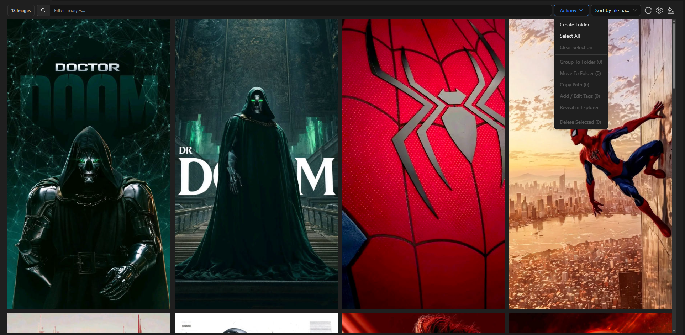
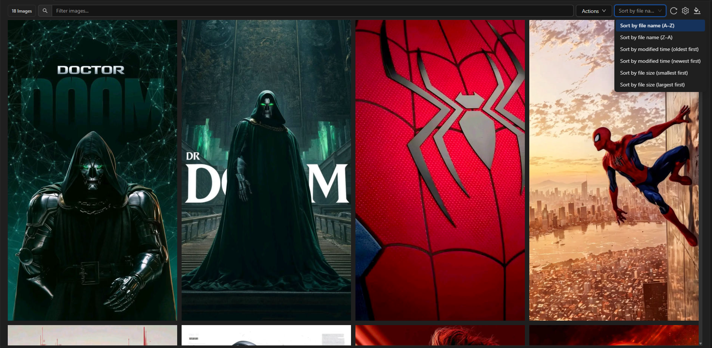
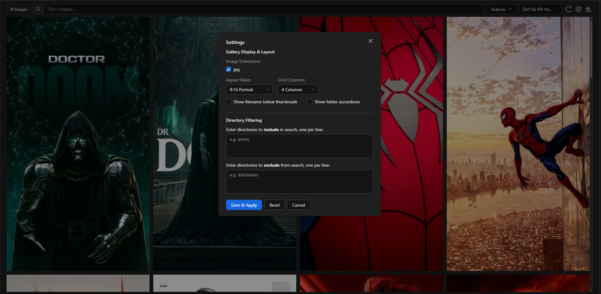
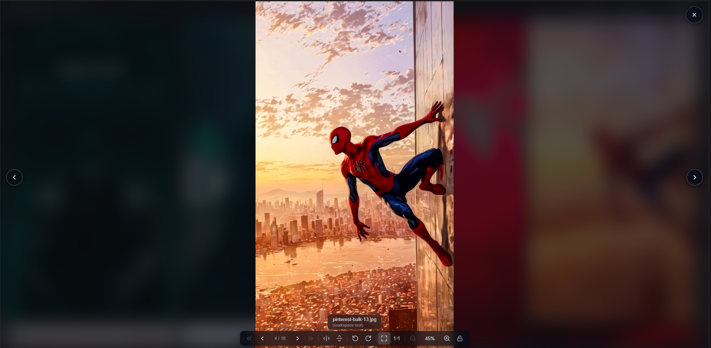

# Image Viewer SE (Spawn Era)

**Image Viewer SE (Spawn Era)** is a lightweight, high-performance image gallery and asset management extension for **VS Code** and **Cursor**. Designed for developers and designers who work with large media libraries, game assets, web UI components, and icons.

---

## 📷 Screenshots

### Gallery & Layout Overview

### High-Resolution Image Preview & Inspection

### Folder Accordions & Multi-Selection Tools

### Display Settings & Aspect Ratio Options

---

## ✨ Features & Enhancements

- **📐 Flexible Aspect Ratios**: Choose between Landscape (`16:9`, `4:3`), Square (`1:1`), and Portrait (`3:4`, `9:16`) grid tiles to match your image aspect ratios perfectly.
- **⚡ High-Performance Virtualized Grid**: Smoothly handles thousands of images using intelligent row virtualization, lazy loading, and disk-cached thumbnail rendering.
- **🔍 Advanced Lightbox Viewer**: Smooth mouse-wheel zooming, double-click toggle, quick horizontal/vertical flipping, rotation, and mini overview map navigation.
- **📁 Folder Scoping & Multi-Tab**: Right-click any folder in VS Code File Explorer to view only that directory tree. Open multiple tabs for different folders simultaneously.
- **🏷️ Batch File Management**: Select multiple images to move, delete, rename, or organize into new folders directly from the webview interface.
- **🎨 Theme & Backdrop Customization**: Supports Light and Dark modes (syncs with VS Code theme), along with transparent, checkerboard, or custom background colors for alpha-channel graphics (PNG, SVG, WebP, AVIF).
- **🔎 Instant Search & Filter**: Filter assets by extension (`.png`, `.jpg`, `.svg`, `.webp`, `.avif`), search by filename/path, and set custom include/exclude folder rules.

---

## 🚀 How to Use

1. **Open Entire Workspace**:
   - Open Command Palette (`Ctrl+Shift+P` / `⌘⇧P`)
   - Type and select **`Image Viewer SE: View Images 🌄`**

2. **Open Scoped Folder**:
   - In VS Code **Explorer**, right-click any folder or image file.
   - Click **`View Images 🌄`** to open a dedicated gallery tab for that specific folder.

---

## 📄 License & Attribution

This extension is an enhanced, modified release maintained by **Spawner Studio (Spawn Era)**.

- **Original Project**: Modified from [vscode-image-viewer](https://github.com/ZhangJian1713/vscode-image-viewer) created by **[ZhangJian1713](https://github.com/ZhangJian1713)**.
- **License**: Released under the [MIT License](LICENSE).
